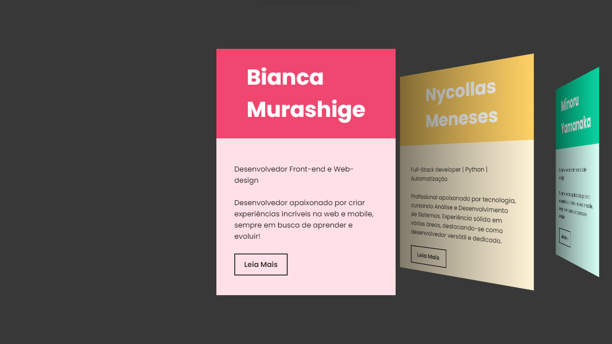
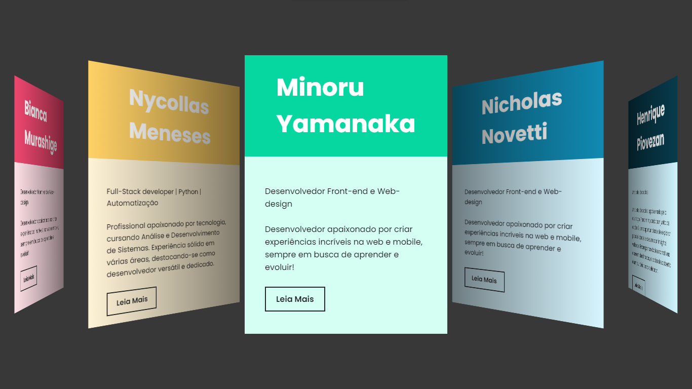
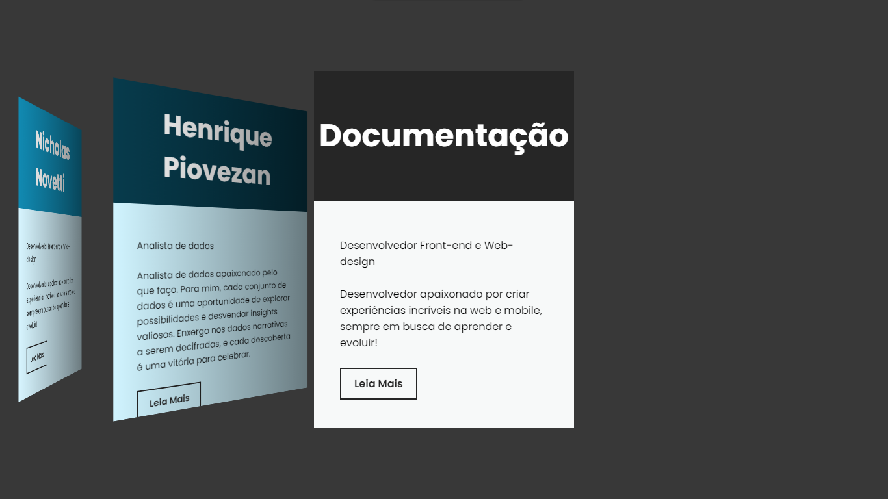
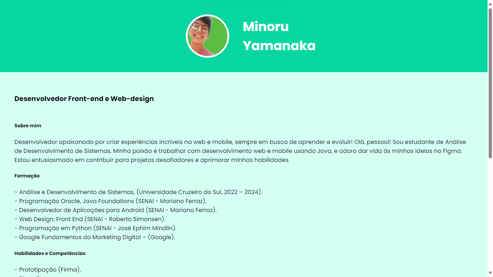
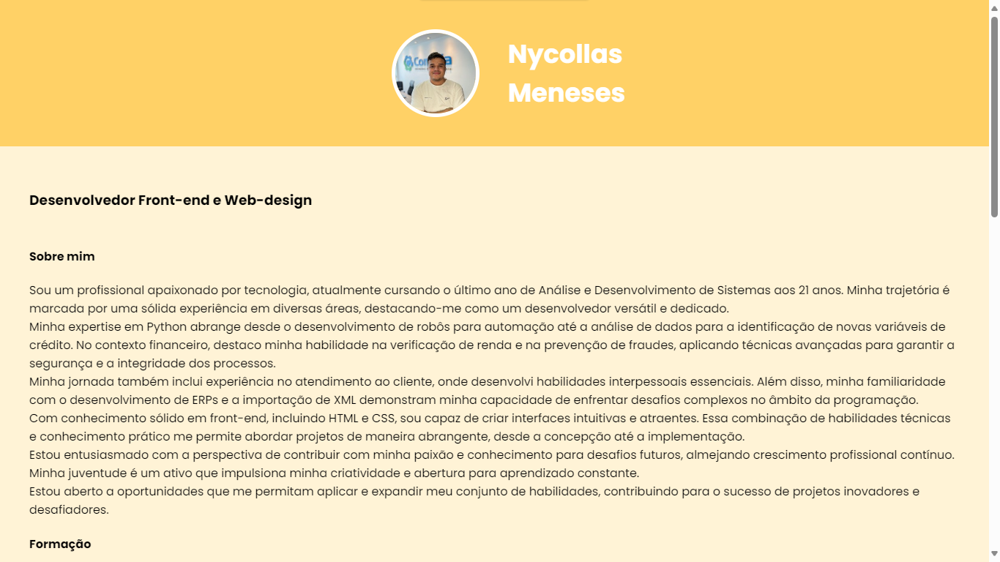

# projeto_site_cv_faculdade

Para criar [site]( https://minoru-yamanaka.github.io/projeto_site_cv_faculdade.github.io/), foram utilizados os seguintes recursos e tecnologias:

1. **HTML (HyperText Markup Language)**:
   - Utilizado para estruturar o conteúdo do site, definindo elementos como cabeçalho, parágrafos, links e divs.
   
2. **CSS (Cascading Style Sheets)**:
   - O arquivo `style.css` é referenciado no cabeçalho do HTML para estilizar os elementos e definir o layout do site.

3. **Swiper.js**:
   - É uma biblioteca JavaScript utilizada para criar o carrossel de slides.
   - Foi incluída através do script externo `swiper-element-bundle.min.js`.
   - O Swiper Custom Element versão 9.4.1 foi utilizado para implementar o carrossel de slides.
   - Esta biblioteca oferece uma variedade de opções para personalizar o comportamento e o visual do carrossel.

4. **Recursos do Swiper.js**:
   - **Pagination**: A paginação foi desabilitada (`pagination="false"`).
   - **Efeito de Transição**: O efeito de transição dos slides foi definido como "coverflow" (`effect="coverflow"`).
   - **Cursor de Agarrar**: O cursor de agarrar foi ativado (`grab-cursor="true"`).
   - **Centralização de Slides**: Os slides foram centralizados (`centered-slides="true"`).
   - **Slides por Visualização**: O número de slides visíveis por vez foi configurado automaticamente com base no espaço disponível (`slides-per-view="auto"`).
   - **Personalização do Efeito Coverflow**: Foram aplicadas diversas configurações para personalizar o efeito "coverflow", como rotação, alongamento, profundidade e sombras dos slides.
   - **Slides Individuais**: Cada slide foi definido dentro de um elemento `<swiper-slide>` com suas respectivas informações.

5. **Conteúdo dos Slides**:
   - Cada slide apresenta informações sobre um membro da equipe, incluindo seu nome e uma breve descrição.
   - Um link "Leia Mais" direciona para uma página específica de cada membro da equipe.

6. **Licença do Swiper.js**:
   - A biblioteca Swiper.js está licenciada sob a Licença MIT e foi lançada em 13 de junho de 2023.

## Telas

## Considerações Finais

**Considerações Finais:**

O desenvolvimento deste site de equipe demonstra o uso eficaz de tecnologias web modernas para criar uma experiência interativa e visualmente atraente. O Swiper.js foi fundamental para implementar o carrossel de slides, permitindo destacar cada membro da equipe de forma individual.

A combinação do HTML para estruturação do conteúdo, CSS para estilização e Swiper.js para a funcionalidade do carrossel resultou em um site dinâmico e responsivo. A utilização do Swiper Custom Element simplificou a implementação do carrossel, proporcionando uma integração suave e um controle detalhado sobre o comportamento dos slides.

Além disso, a inclusão de links "Leia Mais" para cada membro da equipe aumenta a interatividade do site, permitindo que os visitantes acessem mais informações sobre cada integrante.

No geral, o site demonstra uma abordagem criativa e eficiente para apresentar uma equipe, destacando suas habilidades e personalidades de forma envolvente e acessível.

## Dedicação ao Mestre Paulo! 🌟

Nossa aventura pelo mundo encantado da programação web foi emocionante! 📱✨ Entre risadas e alguns bugs no caminho, criamos este site.

Cada linha de código representa um capítulo do nosso aprendizado, e cada bug corrigido é uma batalha vencida! Agradecemos pela sua orientação sábia e paciência infinita.

Esperamos que, assim como suas aulas, este site traga um toque de curiosidade e diversão. Obrigado por tornar a aprendizagem uma jornada única!

Com carinho e emojis programáveis, seus aprendizes 🚀🔮
